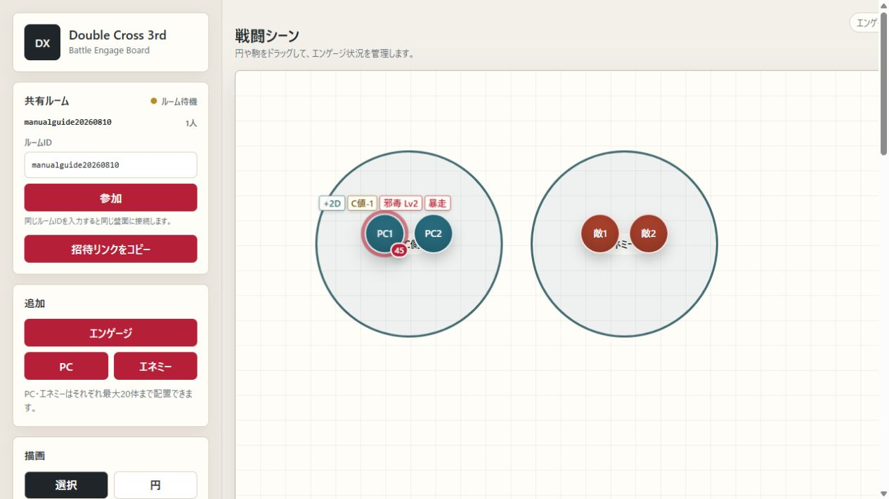
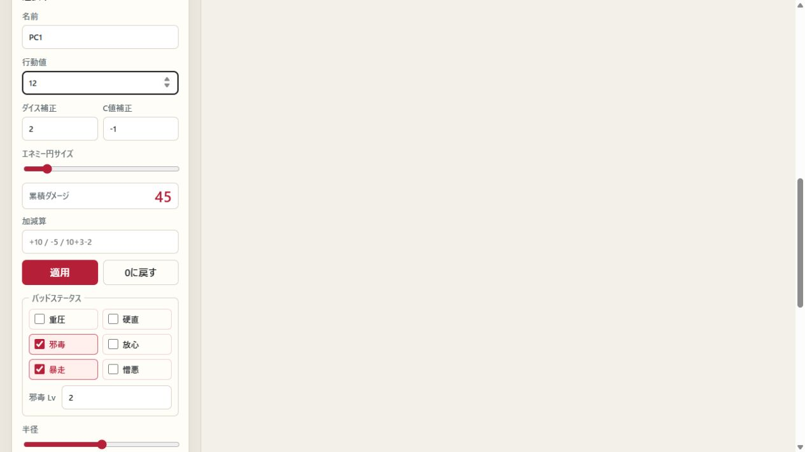

# DX3rd Combat Board 操作マニュアル

## 1. このアプリについて

ダブルクロス The 3rd Editionの戦闘シーンで、エンゲージ、駒、行動値、累積ダメージ、各種補正、バッドステータス、手番を管理するWebアプリです。

同じ共有ルームを使う別画面で、FS判定の進行値、参加者、進行イベント、判定履歴も管理できます。

公開URL: https://tyamashitakss.github.io/dx3rd/

同じルームに参加したメンバーの操作はリアルタイムで共有されます。



## 2. 基本的な始め方

1. 公開URLを開きます。
2. 新しいルームが自動的に作成されます。
3. 「招待リンクをコピー」を押し、参加者へリンクを送ります。
4. 「追加」からエンゲージ、PC、エネミーを配置します。
5. 駒をドラッグしてエンゲージ内へ移動します。
6. 右側の行動値一覧を使って手番を進めます。

PCとエネミーは、それぞれ20体まで作成できます。

### FS判定画面へ移動する

左上の「FS判定」を押すと、同じルームIDを保ったままFS判定画面へ移動します。FS判定画面の「戦闘ボード」を押すと盤面へ戻ります。

### ココフォリアと小窓で併用する

1. 戦闘シーン右上の「小窓表示」を押します。
2. 開いた小窓をココフォリアの上へ置きます。元の戦闘ボードのタブは閉じず、そのままココフォリアのタブへ切り替えてください。
3. 小窓上部の「盤面」と「行動値」で表示内容を切り替えます。
4. 「盤面」では、縮小された盤面上で駒やエンゲージの移動、選択、右クリック設定を行えます。
5. 「行動値」では、手番の開始・進行、対象の選択、右クリック設定を行えます。
6. 「小窓を閉じる」を押すか小窓自体を閉じると、戦闘ボードが元の画面へ戻ります。

Chrome・Edgeでは、操作可能な戦闘ボードが常に手前の小窓として開きます。対応していないブラウザではコンパクト表示の通常ウィンドウが開きます。通常ウィンドウが開かない場合は、このサイトのポップアップを許可してください。どちらの方式でも共有ルームへの同期、Undo・Redo、右クリック設定を利用できます。

## 3. ルームの共有

### 招待リンクを使う

「招待リンクをコピー」を押し、コピーされたURLを参加者へ送ります。リンクを開いた参加者は同じルームへ接続します。

### ルームIDを使う

1. 参加先のルームIDを「ルームID」欄へ入力します。
2. 「参加」を押します。
3. 接続後、同じ盤面が表示されます。

参加人数は共有ルーム欄に表示されます。同期に時間がかかる場合は、数秒待ってからページを再読み込みしてください。

## 4. エンゲージと駒

### エンゲージを追加する

「エンゲージ」を押すと円形のエンゲージが追加されます。選択後、横半径と縦半径を変更すると楕円にできます。

### PC・エネミーを追加する

- 「PC」: 青色のPC駒を追加します。
- 「エネミー」: 赤色のエネミー駒を追加します。
- 「矩形」: ドラッグした大きさの矩形エネミーを追加します。壁や大型エネミーの表現に利用できます。

### 移動と選択

- 駒、エンゲージ、描画オブジェクトはドラッグして移動できます。
- エンゲージを動かすと、その中に所属する駒も一緒に移動します。
- 駒をエンゲージ内へ移動すると所属先が更新されます。
- オブジェクトをクリックすると選択状態になります。
- エンゲージ、描画円、地形、矩形エネミー、円形エネミーを選択すると、外周にリサイズハンドルが表示されます。
- リサイズハンドルをドラッグすると、スライダーを使わずに大きさや縦横比を変更できます。
- 選択中に `Delete` キーを押すと削除できます。

## 5. 描画ツール

描画ツールを選び、ボード上をドラッグして作成します。描画が完了すると自動的に「選択」へ戻ります。

| ツール | 用途 |
| --- | --- |
| 選択 | オブジェクトの選択・移動 |
| 円 | 範囲などを円で表示 |
| 矩形 | 矩形エネミーや壁を作成 |
| 地形 | 海、谷、床などの半透明な地形を作成 |
| 矢印 | 一方向の移動、攻撃、関係線を表示 |
| 両矢印 | 双方向の関係や移動を表示 |

円と地形は、選択時に外周のハンドルをドラッグして大きさを変更できます。矢印と両矢印は、端のハンドルをドラッグして長さと向きを変更できます。選択パネルからの数値指定も引き続き利用できます。

## 6. 駒の設定

駒をクリックすると左側に設定が表示されます。盤面上の駒、左側の一覧、右側の行動値一覧を右クリックしても同じ設定を開けます。



### 名前と行動値

- 名前は空欄のまま保存できます。
- 行動値は右側の一覧で降順に並びます。
- 行動値一覧をクリックすると該当する駒が選択されます。

### ダイス補正・C値補正・攻撃力補正

- ダイス補正に `2` を入力すると「+2D」と表示されます。
- ダイス補正に `-1` を入力すると「-1D」と表示されます。
- C値補正に `1` を入力すると「C値+1」と表示されます。
- C値補正に `-1` を入力すると「C値-1」と表示されます。
- 攻撃力補正に `5` を入力すると「攻撃力+5」と表示されます。
- 攻撃力補正に `-3` を入力すると「攻撃力-3」と表示されます。
- `0` の補正は盤面に表示されません。

### 累積ダメージ

「加減算」欄へ式を入力し、「適用」を押します。

| 入力例 | 結果 |
| --- | --- |
| `10` | 現在値に10を加算 |
| `+10` | 現在値に10を加算 |
| `-5` | 現在値から5を減算 |
| `10+3-2` | 現在値に11を加算 |

「0に戻す」を押すと累積ダメージを0にします。累積ダメージは0未満にはなりません。

エネミーを右クリックすると、入力したダメージを「同じエンゲージの敵」または「全エネミー」へ一括で加減算できます。エンゲージを右クリックした場合も、そのエンゲージの全エネミーまたは盤面上の全エネミーへ一括適用できます。一括操作もUndo・Redoと共有ルームの同期対象です。

### バッドステータス

複数の状態を同時に選択できます。盤面または行動値一覧の状態名にマウスを重ねると説明が表示されます。

| 状態 | 効果 |
| --- | --- |
| 重圧 | オートアクションのエフェクトを使用できない |
| 硬直 | 全力移動および戦闘移動が行えない |
| 邪毒 | クリンナップごとに邪毒のLv×3のHPダメージを受ける |
| 放心 | すべての判定のダイスが2個減少する |
| 暴走 | ガードを含むリアクションとカバーリングができない |
| 憎悪 | 指定されたキャラクターに対して攻撃を行う |

邪毒を選択すると「邪毒 Lv」欄が表示されます。Lvは1〜99で設定できます。

## 7. 手番管理

行動値一覧は「セットアップ」「各キャラクター」「クリンナップ」の順に表示されます。

1. 「手番を開始」を押すとセットアップから開始します。
2. 「次の手番」相当のボタンを押すたびに、行動値順で次へ進みます。
3. 現在の手番は太い赤枠で表示されます。
4. 行動値一覧の項目をダブルクリックすると、その項目を現在の手番として直接指定できます。
5. クリンナップ後は次のラウンドへ進みます。

「ラウンドをリセット」は、そのラウンドの進行状況を最初へ戻します。

## 8. Undo・Redo・初期化

- 「元に戻す」または `Ctrl+Z`: 直前の操作を取り消します。
- 「やり直す」または `Ctrl+Y`: 取り消した操作を戻します。
- 「初期化」: ボード全体を初期状態へ戻します。確認画面が表示されます。

## 9. エクスポートとインポート

### エクスポート

「エクスポート」を押すと、現在の盤面をJSONファイルとして保存します。セッション前のバックアップに利用してください。

### インポート

1. 「インポート」を押します。
2. 以前にエクスポートしたJSONファイルを選択します。
3. 読み込まれた盤面が現在のルームへ反映されます。

インポートすると現在の盤面が置き換わるため、必要に応じて先にエクスポートしてください。

## 10. FS判定を管理する

FS判定画面の公開URLは https://tyamashitakss.github.io/dx3rd/fs/ です。戦闘ボードから移動すると、現在のルームIDをそのまま使用します。

### FS判定を設定する

左側でFS名、判定内容、終了条件、終了進行値、ラウンド制限、判定技能、難易度、最大達成値、支援判定、経験点、メモを設定します。

戦闘ボードに配置されているPCは、名前と行動値が自動的に参加者へ反映されます。「参加者を追加」では、戦闘ボードに存在しないNPCなども登録できます。

参加者は「未行動」「待機」「行動済」を切り替えられます。「次の手番」は行動値順に次の参加者へ進み、全員が行動済みの場合は次のラウンドを開始します。

### 進行判定と支援判定を記録する

1. 「進行判定」または「支援判定」を選びます。
2. 判定者と達成値を入力します。
3. 進行判定では、難易度と最大達成値から加算進行値の候補が表示されます。必要なら数値を修正します。
4. 「履歴へ追加」を押します。

候補値は、達成値が難易度未満なら0、成功時は `1 + floor(min(達成値, 最大達成値) / 10)` で計算されます。
達成値には0以上の整数を入力します。「GM調整」は判定者リストの一番下にあります。

進行値は進行判定と手動調整の履歴から計算されます。複数人が同時に判定を追加した場合も、それぞれの加算値が保持されます。

### 進行イベントを公開する

「新規」から到達進行値、名称、内容、変更後の技能・難易度・支援判定を登録します。指定した進行値へ到達すると「公開待ち」になり、「公開」を押すと参加者の画面にも内容が表示されます。

登録したイベントの進行値は進行バー上のピンで確認できます。イベントを公開すると、そのイベントに設定した技能・難易度・支援判定が現在の表示と判定計算へ自動的に反映されます。複数のイベントが公開されている場合は、進行値が後のイベントから各変更項目を引き継ぎます。

「設定へ反映」を押すと、イベントの変更内容をFSの基本設定として保存できます。非公開は表示上の制御であり、GM専用のアクセス制限ではありません。

ハプニングチャートのロールや結果はFS判定画面には記録されません。ココフォリアで管理してください。

### FS判定を小窓で表示する

「小窓表示」を押すと、FS進行と参加者一覧をコンパクトに表示します。「進行」と「参加者」で表示内容を切り替えられます。

## 11. ココフォリア用ダイス表を作る

FS判定画面下部の「ダイス表作成」は、ココフォリアの `/roll-table` コマンドを生成します。ダイス表は共有ルームへ送信されず、使用中の端末に保存されます。

1. 「新規」を押し、表の名前と `1D6` などのダイス式を入力します。
2. 出目と結果を入力します。`1-5` のような範囲も使用できます。
3. エラーがなくなると「コマンドをコピー」が有効になります。
4. コピーした内容をココフォリアのチャット、またはスクリーンパネルのクリックアクション「チャットに送信」へ貼り付けます。

生成例:

```text
/roll-table
ハプニング表
1D6
1:足場が崩れる
2:増援が現れる
3:変化なし
4:変化なし
5:変化なし
6:状況が好転する
```

対応するダイス式は `nDx`、`D66`、`D66N`、`D66A`、`D66S`、`D66D` です。すべて半角で入力してください。結果文を改行すると、コマンドでは `\n` に変換されます。

「テキストを一括取り込み」では、既存の `/roll-table` 全文、BCDice形式、または `出目:結果` の行を読み込めます。「JSON書出」と「JSON読込」で、複数の表をまとめて別端末へ移動できます。

詳しい書式は[ココフォリア公式の `/roll-table` 説明](https://docs.ccfolia.com/update/v1.33/roll-table)と[BCDiceオリジナル表仕様](https://docs.bcdice.org/original_table.html)を参照してください。

## 12. よくある確認事項

### 他の参加者へ反映されない

- 全員が同じルームIDか確認します。
- 共有ルーム欄の接続状態と参加人数を確認します。
- 数秒待ってからページを再読み込みします。

### 駒や図形を削除したい

対象をクリックして選択し、`Delete` キーまたは選択パネルの「削除」を使用します。

### バッドステータスの説明を確認したい

盤面または行動値一覧に表示された状態名へマウスを重ねます。右クリック設定内では説明は表示されません。

### 操作を間違えた

「元に戻す」または `Ctrl+Z` を使用します。重要な戦闘では定期的なエクスポートもおすすめします。
